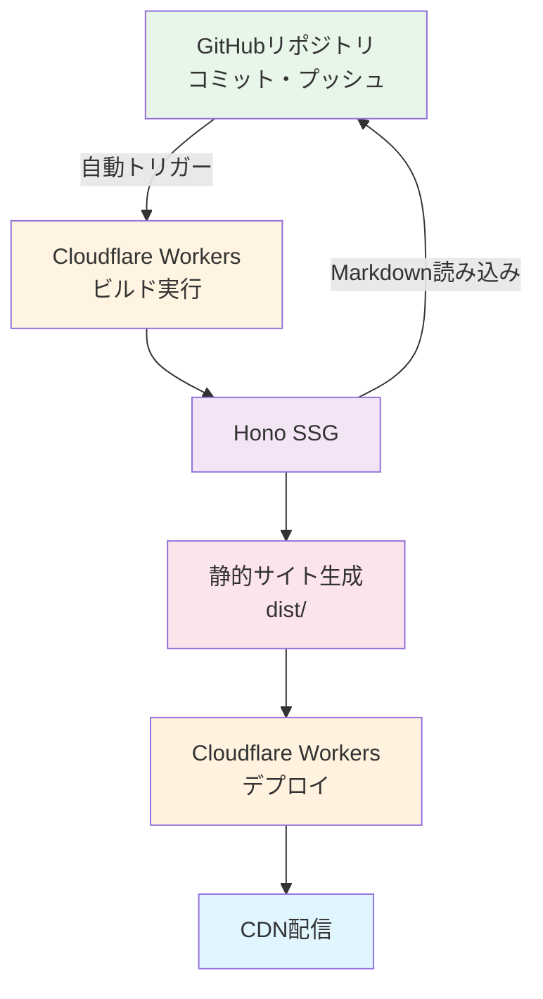

# KFD Studio Blog 実装計画

## プロジェクト概要

| 項目               | 設定値                         |
| ------------------ | ------------------------------ |
| **プロジェクト名** | kfdstudio-blog                 |
| **ドメイン**       | <https://blog.kfdstudio.work/> |

---

## 技術スタック

### フロントエンド

- **フレームワーク**: Hono v4.0+
- **SSG**: Hono SSG (Static Site Generation)
- **スタイリング**: TailwindCSS v4.1+
- **型付け**: TypeScript 5.9.0+
- **JSX**: HonoX (オプション)

### パッケージ管理

- **パッケージマネージャー**: pnpm 10.x.x
- **Linter**: oxlint 0.12.0+
- **Formatter**: oxfmt
- **Pre-commit**: simple-git-hooks 3.3.0+

### デプロイ

- **プラットフォーム**: Cloudflare Workers
- **連携**: GitHub連携（自動デプロイ）
- **DNS**: 既存ドメイン（DNS設定済み）

### Cloudflareリソース

- **KV**: 検索インデックス

### 外部リソース

- **GitHubリポジトリ**: Markdownファイル保存

---

## アーキテクチャ概要

### データフロー



### データ構造

#### GitHubリポジトリ (Markdownファイル)

- **パス**: content/blog/YYYY-MM-DD-slug.md
- **値**: Markdownファイル（frontmatter + 本文）

Frontmatter項目:

- title: 記事タイトル
- description: 記事の説明
- pubDate: 公開日
- updatedDate: 最終更新日（オプション）
- tags: タグ配列（オプション）
- slug: 記事のスラッグ（URLに使用）

#### KV (検索インデックス)

- キー: `search:index`
- 値: 検索用インデックス（JSON）

---

## 実装フェーズ

### フェーズ1: プロジェクトセットアップ

#### 1.1 プロジェクト作成

```bash
pnpm create hono@latest kfdstudio-blog --template cloudflare-workers
cd kfdstudio-blog
```

#### 1.2 依存のインストール

```bash
pnpm install
```

#### 1.3 Lint/Format設定

- oxlint設定ファイルの作成
- oxfmt設定ファイルの作成
- simple-git-hooksの設定

---

### フェーズ2: Cloudflareリソース設定

#### 2.1 wrangler.jsoncの作成

| 設定項目           | 値             |
| ------------------ | -------------- |
| name               | kfdstudio-blog |
| main               | src/index.ts   |
| compatibility_date | 2024-01-01     |

#### 2.2 KVネームスペース

| 設定項目 | 値                  |
| -------- | ------------------- |
| binding  | KV                  |
| id       | `<KV_NAMESPACE_ID>` |

#### 2.3 Cloudflareリソースの作成

- KVネームスペース: blog-search-index

#### 2.4 GitHubリポジトリの作成

- GitHubリポジトリを作成
- content/blog/ ディレクトリを作成

---

### フェーズ3: コンテンツ管理

#### 3.1 Contentディレクトリ構造

```txt
routes/blog/ または content/blog/
  └── YYYY-MM-DD-slug.md
```

#### 3.2 Frontmatterパーサー

- Markdownファイルからfrontmatterを抽出
- frontmatterを型定義

#### 3.3 Content Loader

- 本番環境: GitHubからMarkdownを読み込み
- ローカル環境: ファイルシステムから読み込み

---

### フェーズ4: Hono SSG

#### 4.1 静的サイトの生成

- GitHubからMarkdownファイルを取得
- 各記事のHTMLを生成
- 記事一覧ページを生成
- タグ一覧ページを生成

#### 4.2 ビルドプロセス

1. GitHubからMarkdownを取得
2. 静的サイトを生成
3. 検索インデックスを生成
4. RSSフィードを生成

#### 4.3 出力ディレクトリ

- dist/

---

### フェーズ5: 検索機能

#### 5.1 検索インデックスの生成

- ビルド時に記事から検索インデックスを生成
- KVに保存

#### 5.2 検索対象

- タイトル
- 説明
- 本文
- タグ

#### 5.3 検索API

- GET /api/search
- クエリパラメータで検索語句を指定

#### 5.4 検索UI

- ヘッダーまたはサイドバーに検索ボックス
- リアルタイム検索

---

### フェーズ6: RSSフィード

#### 6.1 RSSの種類

- メインRSS（最新記事）
- タグ別RSS

#### 6.2 RSSの生成

- ビルド時にRSSフィードを生成
- /rss.xml, /rss/tags/[tag].xml

---

### フェーズ7: スタイリング

#### 7.1 TailwindCSSの設定

- 設定ファイルの作成
- カスタムテーマの定義

#### 7.2 コンポーネントのスタイリング

- ヘッダー
- フッター
- 記事一覧
- 記事詳細
- 検索ボックス

---

### フェーズ8: デプロイ

#### 8.1 ビルドコマンド

```bash
pnpm build
```

#### 8.2 デプロイコマンド

```bash
pnpm deploy
```

#### 8.3 GitHub連携

- Cloudflare WorkersとGitHubリポジトリを連携
- 自動デプロイを設定

#### 8.4 デプロイフロー

1. 記事をGitHubリポジトリにコミット・プッシュ
2. Cloudflare Workersで自動ビルド実行
3. Hono SSGで静的サイト生成
4. Cloudflare Workersにデプロイ

---

## 開発コマンド一覧

| コマンド          | 説明                   |
| ----------------- | ---------------------- |
| pnpm dev          | 開発サーバー起動       |
| pnpm build        | 静的サイトをビルド     |
| pnpm preview      | ビルド結果をプレビュー |
| pnpm deploy       | デプロイ               |
| pnpm lint         | Lintチェック           |
| pnpm lint:fix     | Lint修正               |
| pnpm format       | コードフォーマット     |
| pnpm format:check | フォーマットチェック   |
| pnpm typecheck    | TypeScript型チェック   |

---

## Git Hooks

### Pre-commitフック

コミット時に実行:

1. lint:fixでLintエラーを自動修正
2. formatでコードをフォーマット

### Pre-pushフック

プッシュ時に実行:

1. lintでLintチェック
2. typecheckでTypeScript型チェック

---

## パフォーマンス

### 静的サイト

- ビルド時に全ページを生成
- CloudflareのグローバルCDNで配信

### 検索

- KVに事前に保存された検索インデックス
- 高速な検索を提供

### GitHub

- バージョン管理システムとしてMarkdownファイルを管理
- GitHubリポジトリにコミット・プッシュすることで自動的にビルド・デプロイ

---

## トラブルシューティング

### Lintエラー

```bash
pnpm lint:fix
```

### Typeエラー

```bash
pnpm typecheck
```

### ビルドエラー

- 依存を確認
- TypeScriptエラーを確認
- Cloudflare設定を確認

---

## 今後の拡張

### 可能な機能

- コメント機能
- OGP画像自動生成
- シンタックスハイライト
- 画像最適化
- sitemap.xml
- robots.txt
- PWA対応
- 多言語対応

---

## 参考

- [Hono Documentation](https://hono.dev/)
- [Hono SSG Documentation](https://hono.dev/docs/guides/ssg)
- [Cloudflare Workers Docs](https://developers.cloudflare.com/workers/)
- [Cloudflare KV](https://developers.cloudflare.com/kv/)
- [Wrangler CLI](https://developers.cloudflare.com/workers/wrangler/)
- [GitHub REST API](https://docs.github.com/en/rest)
